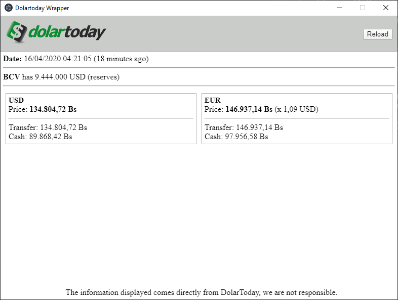

# Electron + typescript + react

Basic boilerplate

## Start
First we need to start react
```npm run start:react```

And then, start electron
```npm run start:electron```

## Env
```env
ELECTRON_DISABLE_SECURITY_WARNINGS=1 // Disable security electron warnings (chrome dev console)
```

## Screenshots

